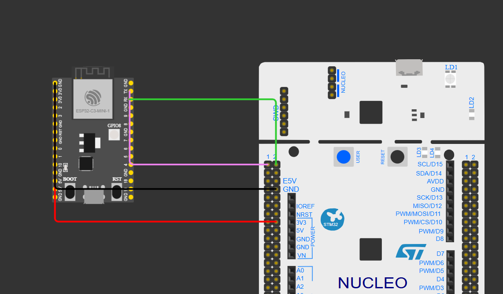

<h1> Dokumentation meines Informatikprojekts</h1>

<h2>Zielsetzung</h2>

Ein kleines Webinterface mit welchem man einen Roboter steuern kann. Dieser hat grundsätzlich die Option zu fahren, und über die Drehzahl der Motoren sich nach Rechts und nach Links zu bewegen. Weitere Funktionalität kann, dann hinzugefügt werden,

<h2>Inhalt</H2>

- System/Gesamtarchitektur

1 Datenbank
1 Webserver
1 Statischen Webserver
1 Mqttbroker
1 Mainprozessor(STM32)
1 Coprozessor(ESP-32 C3 super mini)

Verwendete IDEs:

Visual Studio Code
    -> PlatformIO
LENS

- Datenbankstruktur
USER 1 -> N ROBOTER
Id-> PS     Id -> PS
Name        Nam -> Name
E-Mail      Pas -> Passwort (gehashed)
Passwort    Bez -> Bezeichnung
            UserId -> Fremdschlüssel

- Cloudarchitektur
Zu Komplex

- Hardwarearchitektur
<h2>Verbindung ESP to MQTT Broker</h2>

<h2>Verbindung ESP zu STM</h2>

<h2>Verbindung STM zu Motordriver </h2>

MQTT Topic Struktur:

/user/{userid}/robot/{robotid}/drive

{
    rightMotor: Speed
    leftMotor: Speed
}

Mit JWT-Authentification realisiert
------------

<h2>Systemarchitektur</h2>

<h2> Props an die KI </h2>
-> Debuggen
-> Kubernetes Manifest von Docker Compose
